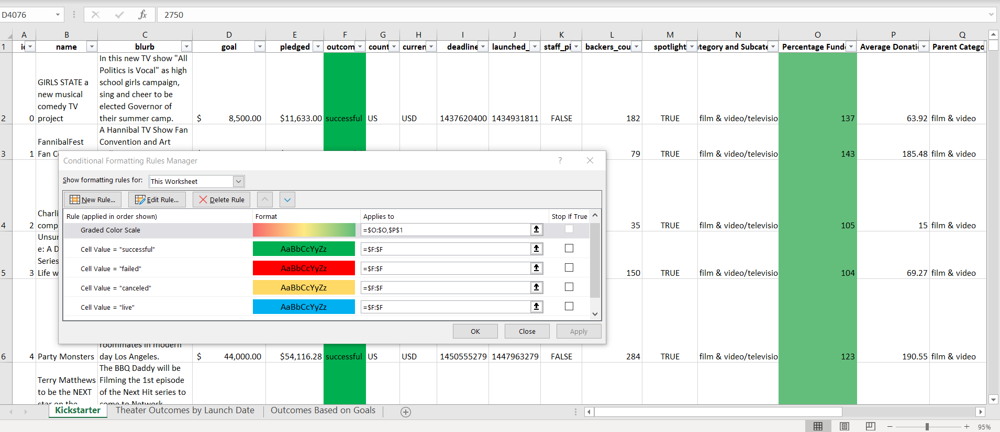

# An analysis for the Kickstarter fundraising Project for Louise
## Overview
Louise, a theater enthusiast wants to launch a Kickstarter campaign to raise funding for her play "Fever". 
She has estimated the cost of the play to be about **$10,000.00** and our goal is to provide her a set of insights by analysing a data set that contains data for almost 4000+ plays which have gone through the similar crowdfunding campaigns.

### Purpose
Our job is to analyse a data set of various plays which also went through the crowdfunding route to raise the funds. We will be leveraging the different functions available in excel to find patterns in this dataset, which in turn may help Louise to setup a strategey for her ucrowdfunding campaign using Kickstarter to maximize the chances for her Kickstarter campaign to succeed.

## Analysis and Challenges
We have a list **4114** plays and their crowdfunding details in **15 different attributes**. To start with our analysis, we have used **Sort and Filter** to adjust the data. Then we have used **conditionl formatting** on column **Goal** to identify the status of all the campaigns.
</img>

Upon anayzing the dataset, we see that 2 columns deadline and laughed_at were not in readable format so we was these 2  