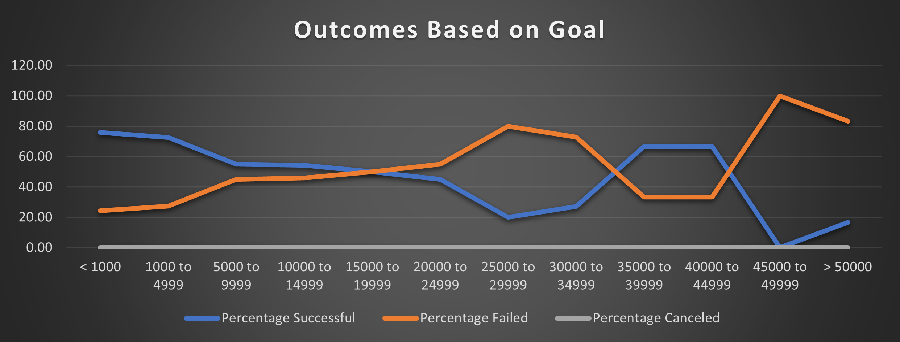

# An analysis for the Kickstarter fundraising Project for Louise using MS Excel.
---

## Overview of the Project undertaken

Louise, a theater enthusiast has launched a Kickstarter campaign to raise funding for her play "Fever". She estimated the cost of the play to be about **$10,000.00** and we helped her in setting up this campaign by doing analysis of a data set that contains data for almost 4000+ projects which have gone through the similar crowdfunding campaigns.

Louises' campaign was successful and she reached close to her funding goal very soon. But now Louise is interested in finding out the outcome of other such campaigns based on their **Launch Date** and **Funding Goals**.

In order to do this analysis, we will be leveraging different functions available in excel to find patterns/trends and insights in this dataset to establish a relation between a campaign's **Launch Date** and its **Funding Goal**.

We will be using different types of Visual charts, graphs and tables to present our findings in a user friendly manner.

### Purpose

Our objective is to provide Louise a visual interpretation of the trends and insights on various campaigns that have gone through the crowdfunding way. Focus is to analyse the relationship between campaign's **Launch Date** and its **Funding Goal**.

## Analysis and Challenges

Our Data set contains a list of **4114** plays and their crowdfunding details against **14 different attributes**. To start with our analysis, we have used **Sort and Filter** to adjust the data. Then we have used **conditionl formatting** on column **Goal** to identify the status of all the campaigns. 

---
</img>
---

Apart from these, we have used several inbuilt functions such as **Round, IFERROR, Year** etc to analyse our data set.

Then we have created a Pivottable and a Pivotchart using **Date Created Converted** attribute and finding the number of all campaigns based on their respective outcome This data is anaysed only for the Parent Category **Theatre**.

The second chart that we used to analyse is a Line chart shown below as **Outcomes based on Goals**. In this we have analysed all the campaigns with subcategory as **plays** based on theor funding goal amount range. We used **COUNTIFS** function to extract this data from the main data set in **Kickstarter** sheet of the workbook.

### Challenges and Difficulties Encountered

Some of the attributes were not in a readable format. So we converted the data for these columns **deadline and launched_at** to make it readable in **Date** format.

---
</img>
---

## Results

1. From the graph **Theater Outcomes by Launch Date**, we can see that:
    - Out of a total of 1393 crowdfunding campaigns launched for Theatre category, 839 were able to achieve the crowdfunding goal, while 493 could not i.e. almost 60% of campaigns for this category were able to reach to the funding goal.

    - May and June seems to be the most prefferable time to launch a campaign as these 2 months saw most number of campaign launches. 

    - While on the other hand November and December are the least preferrable months.

    We can also observe that, keeping aside the number of launches for a given month, usually the ratio between successful and failed campaign is around 2:1 approximately.

---
</img>
---

2. In another graph **Outcomes Based on Goals**, shown as below, We looked at the Outcomes based on the Goal amount for the campaigns subcategory as **Plays** and below are our observations from this.

    - We can observe that almost 70% of campaigns had a goal amount of below $ 5000. This gets reflected in the number of succesfull campaigns as well as almost 75% of these campaigns achieved their funding goal.

    - Another trend we could see here is that too high of a goal amount impacts the chances of the campaign being successful adversely. 
---
</img>
---

### Limitations of the Data set

- The data is for the period 2009-2017. Though the period covered is substantial, but it does not contain data for last 3 years. In an everchanging world this may prove to be a deciding factor.
- There are several outliers in terms of funding Goal. On one hand there are some very high funding goal campaigns and on  other there are some with very low goal amount.
-  Its also not metioned that if the given campaign is expecting to raise all the funds via crowdfunding or its just one of the strategies. 

### Other possible graphs

1. We could create some other charts which would tell us how **Plays** as a subcategory fair against any other subcategory in terms of Funding received.
2. We can also create a graph which would tell us usually how many backers are there for a particular subcategory and compare it to judge the same data for **Plays** subcategory.
3. We can also create a chart depicting the average no of days a **Plays** subcategory campaign is active in order to be succesfull.

